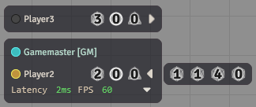

# Shared Dice

Shared Dice is a Foundry VTT module that allows Game Masters to give players various types of 'Shared Dice'. These dice act as expendable resources that players can use or share with each other. Each action involving a shared die can trigger a customizable chat message, featuring keywords that are automatically replaced with relevant information.

# Features

- **Multiple Dice Types:** Define several distinct types of shared dice, each with its own name, image, usage limit, and chat message templates.
- **Management:** Users with editing permissions can easily add or remove dice from players directly through the player list interface.
- **Player Usage:** Players can expend their own dice or gift dice from their own pool to other players.
- **Customizable Chat Messages:** Tailor the chat messages for actions like adding, removing, using, or gifting dice. Messages are configured per dice type and per action.
- **Dynamic UI:** Intelligently handles users with many dice types by collapsing less-used dice into an expandable overflow section in the player list.

# Installation

This module can be installed from the Foundry VTT module browser or via manifest url from the latest release: `https://github.com/belodri/shareddice/releases/latest/download/module.json`

# Configuration

The primary configuration for this module involves defining the different **Dice Types** you want to use in your game. This is done through the module's settings menu. For each Dice Type, you can configure:

- **Name:** The display name for this type of die (e.g., "Inspiration" or "Hero Point"). This is used in UI elements and chat messages via the `[$dieName]` placeholder.
- **Image:** An icon to represent the die in the UI.
- **Enabled:** A checkbox to control if this dice type is currently active. Disabled dice are hidden and not usable but their data is preserved and they can be reenabled at any time. This allows you to temporarily remove a dice type without losing player counts or its specific configurations.
- **Limit:** The maximum number of this dice type a player can hold.
- **Message Templates:** For each action (`add`, `remove`, `use`, `gift`), you can define a chat message template. If a template is left blank, no chat message will be sent for that specific action and dice type.


# Usage & Interface



### Dice Icons (Editor)

For users with editing permissions (typically the GM), clicking on dice icons has the following effects:

- **Add (click):** Adds one of that die type to the player, up to the defined limit for that die.
- **Remove (right-click):** Removes one of that die type from the player, down to zero.

### Dice Icons (Player)

For users users without editing permissions, the functionality of left-clicks on dice icons depends on if they click on one of their own die (next to their username) or on another player's die:

- **Use (click own die):** Uses one of that die if the player has any uses remaining.
- **Gift (click others' die):** Gifts one of the die to the player, up to the defined limit for that die type, provided the giving player has at least one use remaining.

### Overflow Toggle

Only the first 3 enabled dice types are displayed on the player list. Any additional enabled dice types can be viewed by toggling the overflow button.

- **Toggle Single Overflow (click):** Expands or collapses the view of additional dice types for that user.
- **Toggle All Overflows (right-click):** Expands or collapses the view of additional dice types for all users.


# Chat Message Placeholders

When configuring message templates in the module settings, you can use the following placeholders. They will be automatically replaced with the relevant information when a message is generated:

- `[$sourceUser]` - Replaced with the name of the user who initiated the action.
- `[$targetUser]` - Replaced with the name of the user who is the target of the action.
- `[$dieName]` - Replaced with the configured name of the die involved in the action.

**Example Gift Message Template:** `[$sourceUser] generously gifts one [$dieName] to [$targetUser]!`

# API

The API can be accessed at game.modules.get("shareddice").api or through the global namespace `shareddice`.

```js
/**
 * Get the quantity of a specific die from the user.
 * @param {User|string} targetUserOrId                  The user or userId.
 * @param {string} [diceId=null]                        If falsey, returns a record of all dice on the user instead.
 * @returns {number|Record<string, number>|undefined}   Returns undefined if no record was found. The keys in the record are diceIds.
 */
function getUserDice(targetUserOrId, diceId=null)
```

```js
/**
 * Add a die of a given id to a user.
 * @param {User|string} targetUserOrId          The user or userId.
 * @param {string} diceId                       The id of the dice to add.
 * @returns {Promise<ChatMessage|true>|null}    Resolves to the resulting ChatMessage, true if no message template was configured, or null on failure.
 */
async function add(targetUserOrId, diceId)
```

```js
/**
 * Remove a die of a given id to a user.
 * @param {User|string} targetUserOrId          The user or userId.
 * @param {string} diceId                       The id of the dice to remove.
 * @returns {Promise<ChatMessage|true|null>}    Resolves to the resulting ChatMessage, true if no message template was configured, or null on failure.
 */
async function remove(targetUserOrId, diceId)
```

```js
/**
 * Use a given die.
 * @param {string} diceId                       The id of the dice to use.
 * @returns {Promise<ChatMessage|true|null>}    Resolves to the resulting ChatMessage, true if no message template was configured, or null on failure.
 */
async function use(diceId)
```

```js
/**
 * Gift one use of a die to another user.   
 * @param {User|string} targetUserOrId          The user or userId who should receive the die.
 * @param {string} diceId                       The id of the dice to gift.
 * @returns {Promise<ChatMessage|true|null>}    Resolves to the resulting ChatMessage, true if no message template was configured, or null on failure.
 */
async function gift(targetUserOrId, diceId)
```

Additionally the DiceType data model is accessible through the `DiceType` property on the API.

# Hooks

This module exposes several hooks that allow other modules or macros to react to or modify its behavior.

## API Action Hooks

These hooks fire around the core actions of adding, removing, using, or gifting dice.

```js
/**
 * A hook event that fires before a die is added to a target.
 * @param {string} diceId                           Id of the die being added.
 * @param {User} targetUser                         The user whose die is about to be added.
 * @param {number} newQuant                         The new quantity of the die the target user would have after adding.
 * @returns {boolean}                               Return `false` to prevent the die from being added.
 */
Hooks.call("shareddice.preAdd", diceId, targetUser, newQuant)
```

```js
/**
 * A hook event that fires after a die is added to a target.
 * @param {string} diceId                           Id of the die being added.
 * @param {User} targetUser                         The user whose die was added.
 * @param {number} newQuant                         The quantity of the die the target has.
 */
Hooks.callAll("shareddice.add", diceId, targetUser, newQuant)
```

```js
/**
 * A hook event that fires before a die is removed from a target.
 * @param {string} diceId                           Id of the die being removed.
 * @param {User} targetUser                         The user whose die is about to be removed.
 * @param {number} newQuant                         The new quantity of the die the target user would have after removal.
 * @returns {boolean}                               Return `false` to prevent the die from being removed.
 */
Hooks.call("shareddice.preRemove", diceId, targetUser, newQuant)
```

```js
/**
 * A hook event that fires after a die is removed from a target.
 * @param {string} diceId                           Id of the die being removed.
 * @param {User} targetUser                         The user whose die was removed.
 * @param {number} newQuant                         The quantity of the die the target has left.
 */
Hooks.callAll("shareddice.remove", diceId, targetUser, newQuant)
```

```js
/**
 * A hook event that fires before a die is used.
 * @param {string} diceId                           Id of the die being used.
 * @param {number} newQuant                         The quantity of the die the user would have left after using.
 * @returns {boolean}                               Return `false` to prevent the die from being used.
 */
Hooks.call("shareddice.preUse", diceId, newQuant);
```

```js
/**
 * A hook event that fires after a die is used.
 * @param {string} diceId                           Id of the die being used.
 * @param {number} newQuant                         The quantity of the die the user has left.
 */
Hooks.callAll("shareddice.use", diceId, newQuant)
```

```js
/**
 * A hook event that fires before a die is gifted to a target.
 * @param {string} diceId                           Id of the die being gifted.
 * @param {User} targetUser                         The user about to receive the die.
 * @param {number} newSelfQuant                     The quantity of the die the user would have left after gifting.
 * @param {number} newTargetQuant                   The new quantity of the die the target user would have after gifting.
 * @returns {boolean}                               Return `false` to prevent the die from being gifted.
 */
Hooks.call("shareddice.preGift", diceId, targetUser, newSelfQuant, newTargetQuant)
```

```js
/**
 * A hook event that fires after a die is gifted to a target.
 * @param {string} diceId                           Id of the die being gifted.
 * @param {User} targetUser                         The user who received the die.
 * @param {number} newSelfQuant                     The quantity of the die the user has left after gifting.
 * @param {number} newTargetQuant                   The new quantity of the die the target user has after gifting.
 */
Hooks.callAll("shareddice.gift", diceId, targetUser, newSelfQuant, newTargetQuant )
```

## Chat Message Hooks

These hooks fire around the creation of chat messages by the module.

```js
/**
 * A hook event that fires before a chat message is created.
 * @param {string} action                                               The action for which the chat message is about to be created.
 * @param {string} diceId                                               The id of the dice type of the used in the action.
 * @param {User} [targetUser=undefined]                                 The target user of the action, if the action has a target. 
 * @param {ChatMessageData} msgData                                     The message data used to create the message. Can be mutated.
 * @returns {boolean}                                                   Return `false` to prevent the chat message from being created.
 */
Hooks.call("shareddice.preCreateChatMessage", action, diceId, targetUser, msgData)
```

```js
/**
 * A hook event that fires after a chat message is created.
 * @param {string} action                                                   The action for which the chat message has been created.
 * @param {string} diceId                                                   The id of the dice type of the used in the action.
 * @param {User} [targetUser=undefined]                                     The target user of the action, if the action had a target. 
 * @param {ChatMessage} message                                             The created chat message.
 */
Hooks.callAll("shareddice.createChatMessage", action, diceId, targetUser, message )
```

# Reporting Issues and Requesting Features

If you are experiencing a bug or have an idea for a new feature, submit an [issue](https://github.com/belodri/shareddice/issues).


# Acknowledgements 

Thanks to Hadalonut for his [BonusDie](https://github.com/HadaIonut/Foundry-BonusDie) module which served as inspiration and starting point for this project.
