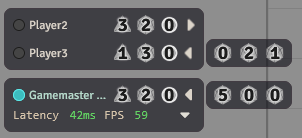

# Shared Dice

Shared Dice is a Foundry VTT module that allows Game Masters to give players various types of 'Shared Dice'. These dice act as expendable resources that players can use or share with each other. Each action involving a shared die can trigger a customizable chat message, featuring keywords that are automatically replaced with relevant information.

# Features

- **Multiple Dice Types:** Define several distinct types of shared dice, each with its own name, image, usage limit, and chat message templates.
- **Management:** Users with editing permissions can easily add or remove dice directly through the player list interface.
- **Usage:** Players can expend their own dice or gift dice from their own pool to other players.
- **Customizable Chat Messages:** Tailor the chat messages for actions like adding, removing, using, or gifting dice. Messages are configured per dice type and per action.
- **Dynamic UI:** Intelligently handles large number of different dice types by collapsing additional dice types beyond the configured display count into an expandable overflow section in the player list. The sort order and the number of displayed dice can be configured via settings.

# Installation

This module can be installed from the Foundry VTT module browser or via manifest url from the latest release: `https://github.com/belodri/shareddice/releases/latest/download/module.json`

# Configuration

The primary configuration for this module involves defining the different **Dice Types** you want to use in your game. This is done through the module's settings menu, accessible only to GMs. Within this menu, you can create new dice types, as well as configure or delete existing ones. 
To save your changes, click the 'Save' button at the bottom of the menu. If you have deleted any dice types, a confirmation prompt will appear before these deletions are saved.

### Dice Type Configuration

For each Dice Type, you can configure the following properties:

- **Name:** The display name for this type of die (e.g., "Inspiration" or "Hero Point"). This is used in UI elements and chat messages via the `[$dieName]` placeholder.
- **Image:** An icon to represent the die in the UI.
- **Enabled:** A checkbox to control if this dice type is currently active. Disabled dice are hidden and not usable but their data is preserved and they can be reenabled at any time. This allows you to temporarily remove a dice type without losing player counts or its specific configurations.
- **Limit:** The maximum number of this dice type a user can hold. Can be set to 0 to allow unlimited dice.
- **Gift Toggle:** Controls if users are allowed to gift their own uses of this dice type to others.  
- **Sort Priority:** Determines the order in which dice are displayed on the player list. Dice with a higher priority are displayed closer to the user names.
- **Message Templates:** For each action (`add`, `remove`, `use`, `gift`), you can define a chat message template. If a template is left blank, no chat message will be sent for that specific action and dice type.
- **Add/Remove Permissions:** Allows GMs to adjust the permissions required to add or remove dice of this dice type for the other user roles (player, trusted player, and assistant gamemaster) using the following options:
    - **None:** These users cannot add or remove this dice type.
    - **Self Only:** These users can add or remove this dice type for themselves but not for other users.
    - **All Users:** Allows adding and removing of this dice type for themselves and for other users.

### Chat Message Placeholders

When configuring message templates for a given dice type, you can use the following placeholders. They will be automatically replaced with the relevant information when a message is generated:

- `[$sourceUser]` - Replaced with the name of the user who initiated the action.
- `[$targetUser]` - Replaced with the name of the user who is the target of the action.
- `[$dieName]` - Replaced with the configured name of the die involved in the action.
- `[$amount]` - Replaced with the quantity of the die involved in the action.  

**Example Gift Message Template:** `[$sourceUser] generously gifts [$amount] [$dieName] to [$targetUser]!`


# Usage & Interface



### Dice Icons

Clicking on the dice icons has the following effects:

- **Use (click own die):** Uses one of that die if the user has any uses remaining.
- **Gift (click others' die):** Gifts one of the die to another player, up to the defined limit for that die type, provided the giving player has at least one use remaining and the dice type is configured to allow gifting.

Additionally, if a user has add/remove permissions for a given dice type, they can also use the following:

- **Add (ctrl + click):** Adds one of that die type to the player, up to the defined limit for that die.
- **Remove (ctrl/cmd + right-click):** Removes one of that die type from the player, down to zero.

If the **Fine Dice Controls** client setting is enabled, these clicks instead open a dialog window, allowing you to use, gift, add, or remove multiple uses of a die at once.

### Overflow Toggle

The maximum number of icons displayed on the player list can be configured via the settings (default 3). If additional dice types are enabled, they can be viewed by toggling the overflow button.

- **Toggle Single Overflow (click):** Expands or collapses the view of additional dice types for that user.
- **Toggle All Overflows (right-click):** Expands or collapses the view of additional dice types for all users.


# API

The API can be accessed at game.modules.get("shareddice").api or through the global namespace `shareddice`.

```js
/**
 * Get the quantity of a specific die from the user.
 * @param {User|string} targetUserOrId                  The user or userId.
 * @param {string} [diceId=null]                        If falsey, returns a record of all dice on the user instead.
 * @returns {number|Record<string, number>|undefined}   Returns undefined if no record was found. The keys in the record are diceIds.
 */
function getUserDice(targetUserOrId, diceId=null)
```

```js
/**
 * Find a DiceType by name.
 * @param {string} dieName                  The name to search for.
 * @param {boolean} [rawData=false]         If true, returns raw data objects instead of DiceType instances.
 * @returns {DiceType[]|object[]}           An array of all dice types with that name or an array of objects of said dice types.
 */
function findDiceTypesByName(dieName, rawData=false)
```

```js
/**
 * Add a die of a given id to a user and creates the chat message.
 * @param {User|string} targetUserOrId          The user (or userId) whose die to add. 
 * @param {string} diceId                       The id of the die to add.
 * @param {object} [config]                     Additional configuration options.
 * @param {number} [config.amount=1]            How many die should be added? Default = 1;
 * @param {boolean} [config.chatMessage=true]   Should a chat message be created?
 * @param {object} [config.messageData]         The data object to use when creating the message.
 * @returns {Promise<boolean>}                  A promise that resolves to true if the action was successful, or false if not.
 */
async function add(targetUserOrId, diceId,  {amount=1, chatMessage=true, messageData={}}={})
```

```js
/**
 * Remove a die of a given id from a user and creates the chat message.
 * @param {User|string} targetUserOrId          The user (or userId) whose die to remove. 
 * @param {string} diceId                       The id of the die to remove.
 * @param {object} [config]                     Additional configuration options.
 * @param {number} [config.amount=1]            How many die should be removed? Default = 1;
 * @param {boolean} [config.chatMessage=true]   Should a chat message be created?
 * @param {object} [config.messageData]         The data object to use when creating the message.
 * @returns {Promise<boolean>}                  A promise that resolves to true if the action was successful, or false if not.
 */
async function remove(targetUserOrId, diceId,  {amount=1, chatMessage=true, messageData={}}={})
```

```js
/**
 * Use a given die.
 * @param {string} diceId                       The id of the die to use.
 * @param {object} [config]                     Additional configuration options.
 * @param {number} [config.amount=1]            How many die should be used? Default = 1;
 * @param {boolean} [config.chatMessage=true]   Should the chat message be created?
 * @param {object} [config.messageData]         The data object to use when creating the message.
 * @returns {Promise<boolean>}                  A promise that resolves to true if the action was successful, or false if not.
 */
async function use(diceId, {amount=1, chatMessage=true, messageData={}}={})
```

```js
/**
 * Gift one use of a die to another user.
 * @param {User|string} targetUserOrId          The user (or userId) who should receive the die. 
 * @param {string} diceId                       The id of the die to gift.
 * @param {object} [config]                     Additional configuration options.
 * @param {number} [config.amount=1]            How many die should be gifted? Default = 1;
 * @param {boolean} [config.chatMessage=true]   Should the chat message be created?
 * @param {object} [config.messageData]         The data object to use when creating the message.
 * @returns {Promise<boolean>}                  A promise that resolves to true if the action was successful, or false if not.
 */
async function gift(targetUserOrId, diceId, {amount=1, chatMessage=true, messageData={}}={})
```

Additionally the DiceType data model is accessible through the `DiceType` property on the API.

# Hooks

This module exposes several hooks that allow other modules or macros to react to or modify its behavior.

## API Action Hooks

These hooks fire around the core actions of adding, removing, using, or gifting dice.

```js
/**
 * A hook event that fires before a die is added to a target.
 * @function shareddice.preAdd
 * @memberof hookEvents
 * @param {string} diceId            Id of the die being added.
 * @param {User} targetUser          The user whose die is about to be added.
 * @param {number} amount            The quantity of the die about to be added.
 * @returns {boolean}                Return `false` to prevent the die from being added.
 */
Hooks.call("shareddice.preAdd", diceId, targetUser, amount)
```

```js
/**
 * A hook event that fires after a die is added to a target.
 * @function shareddice.add
 * @memberof hookEvents
 * @param {string} diceId           Id of the die being added.
 * @param {User} targetUser         The user whose die was added.
 * @param {number} amount           The quantity of the die that was added.
 */
Hooks.callAll("shareddice.add", diceId, targetUser, amount)
```

```js
/**
 * A hook event that fires before a die is removed from a target.
 * @function shareddice.preRemove
 * @memberof hookEvents
 * @param {string} diceId                           Id of the die being removed.
 * @param {User} targetUser                         The user whose die is about to be removed.
 * @param {number} amount                           The quantity of the die about to be removed.
 * @returns {boolean}                               Return `false` to prevent the die from being removed.
 */
Hooks.call("shareddice.preRemove", diceId, targetUser, amount)
```

```js
/**
 * A hook event that fires after a die is removed from a target.
 * @function shareddice.remove
 * @memberof hookEvents
 * @param {string} diceId                           Id of the die being removed.
 * @param {User} targetUser                         The user whose die was removed.
 * @param {number} amount                           The quantity of the die that was removed.
 */
Hooks.callAll("shareddice.remove", diceId, targetUser, amount)
```

```js
/**
 * A hook event that fires before a die is used.
 * @function shareddice.preUse
 * @memberof hookEvents
 * @param {string} diceId                           Id of the die being used.
 * @param {number} amount                           The quantity of the die about to be used.
 * @returns {boolean}                               Return `false` to prevent the die from being used.
 */
Hooks.call("shareddice.preUse", diceId, amount);
```

```js
/**
 * A hook event that fires after a die is used.
 * @function shareddice.use
 * @memberof hookEvents
 * @param {string} diceId                           Id of the die being used.
 * @param {number} amount                           The quantity of the die that was used.
 */
Hooks.callAll("shareddice.use", diceId, amount)
```

```js
/**
 * A hook event that fires before a die is gifted to a target.
 * @function shareddice.preGift
 * @memberof hookEvents
 * @param {string} diceId                           Id of the die being gifted.
 * @param {User} targetUser                         The user about to receive the die.
 * @param {number} amount                           The quantity of the die about to be gifted.
 * @returns {boolean}                               Return `false` to prevent the die from being gifted.
 */
Hooks.call("shareddice.preGift", diceId, targetUser, amount)
```

```js
/**
 * A hook event that fires after a die is gifted to a target.
 * @function shareddice.gift
 * @memberof hookEvents
 * @param {string} diceId                           Id of the die being gifted.
 * @param {User} targetUser                         The user who received the die.
 * @param {number} amount                           The quantity of the die that was gifted.
 */
Hooks.callAll("shareddice.gift", diceId, targetUser, amount)
```

## Chat Message Hooks

These hooks fire around the creation of chat messages by the module.

```js
/**
 * A hook event that fires before a chat message is created.
 * @function shareddice.preCreateChatMessage
 * @memberof hookEvents
 * @param {"add"|"remove"|"use"|"gift"} action                              The action for which the chat message is about to be created.
 * @param {string} diceId                                                   The id of the dice type of the used in the action.
 * @param {User|undefined} targetUser                                       The target user of the action, if the action has a target. 
 * @param {number} amount                                                   The amount the die was changed by.
 * @param {ChatMessageData} msgData                                         The message data for the chat message about to be created. Can be mutated.
 * @returns {boolean}                                                       Return `false` to prevent the chat message from being created.
 */
Hooks.call("shareddice.preCreateChatMessage", action, diceId, targetUser, amount, msgData)
```

```js
/**
 * A hook event that fires after a chat message is created.
 * @function shareddice.createChatMessage
 * @memberof hookEvents
 * @param {"add"|"remove"|"use"|"gift"} action                              The action for which the chat message has been created.
 * @param {string} diceId                                                   The id of the dice type of the used in the action.
 * @param {User|undefined} targetUser                                       The target user of the action, if the action had a target.
 * @param {number} amount                                                   The amount the die was changed by.
 * @param {ChatMessage} message                                             The created chat message.
 */
Hooks.callAll("shareddice.createChatMessage", action, diceId, targetUser, amount, message)
```

# Reporting Issues and Requesting Features

If you are experiencing a bug or have an idea for a new feature, submit an [issue](https://github.com/belodri/shareddice/issues).


# Acknowledgements 

Thanks to Hadalonut for his [BonusDie](https://github.com/HadaIonut/Foundry-BonusDie) module which served as inspiration and starting point for this project.
